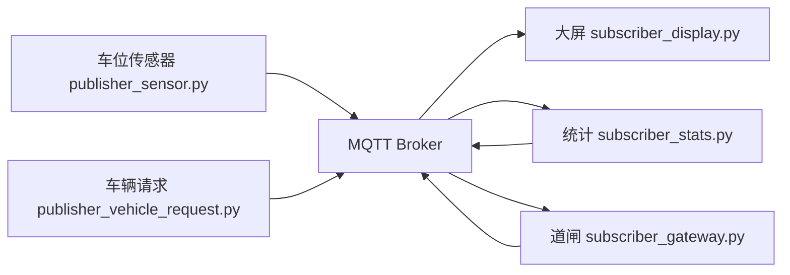

# 智能停车 MQTT 原型

这是一个基于 MQTT 的智能停车场课程原型，使用 Python 模拟车位传感器、停车场大屏、统计服务和入口道闸。

项目目标是展示一个简单但完整的物联网消息流：
- 车位传感器持续发布车位状态
- 大屏实时订阅并显示空闲/占用情况
- 统计服务汇总全部车位状态
- 入口道闸根据空闲车位数量决定是否开闸

## 项目结构

`智能停车/` 目录下包含主要代码：
- `publisher_sensor.py`：模拟 5 个车位传感器
- `publisher_vehicle_request.py`：模拟车辆到达停车场入口并发送入场请求
- `subscriber_display.py`：订阅车位状态，显示停车场大屏
- `subscriber_stats.py`：统计空闲车位并发布汇总结果
- `subscriber_gateway.py`：根据车辆请求和统计结果决定是否开闸
- `requirements.txt`：项目依赖

## MQTT 主题设计

- `parking/lot/A01/status`：单个车位状态
- `parking/lot/+/status`：所有车位状态
- `parking/stats/summary`：停车场统计结果
- `parking/gate/request`：车辆入场请求
- `parking/gate/entry`：道闸控制结果

## 系统流程图



## 运行方法

1. 安装依赖

```bash
pip install -r 智能停车/requirements.txt
```

2. 分别打开多个终端，按顺序运行

```bash
python 智能停车/subscriber_stats.py
python 智能停车/subscriber_display.py
python 智能停车/subscriber_gateway.py
python 智能停车/publisher_sensor.py
python 智能停车/publisher_vehicle_request.py
```

3. 观察效果
- 大屏会实时显示 5 个车位的状态
- 统计服务会输出空闲车位数量
- 当车辆发起入场请求时，道闸会根据空闲车位决定是否开闸

## 适合作业展示的亮点

- 使用 MQTT 完成 publish / subscribe 的完整演示
- 模拟了智能停车场中的多个角色
- 代码结构清晰，方便组员分工
- 可以继续扩展成预约停车、计费和数据分析系统
